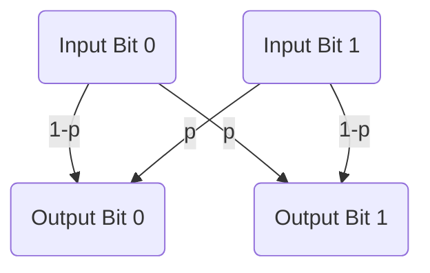

The Binary Symmetric Channel (BSC) is one of the simplest models in information theory and digital communication, it is a channel that transmits binary symbols, where each bit transmitted can either be received correctly or flipped to the opposite value due to noise. The channel is characterized by a fixed probability of error, denoted by , which is the probability that a transmitted bit is received incorrectly. Mathematically, if $X$ is the input bit and $Y$ is the output bit, then:
$$P(Y=X)=1-p, \quad P(Y \neq X)=p$$
A common way to visualize the BSC is with a simple diagram:

The [[Channel Capacity]] $C$ of the Binary Symmetric Channel, which represents the maximum rate at which information can be reliably transmitted over the channel, is given by:
$$
C=1-H(p)
$$
where $H(p)$ is the binary entropy function defined as:
$$
H(p)=-p \log _2(p)-(1-p) \log _2(1-p)
$$
The channel capacity tells us how much information can be sent through the BSC with an arbitrarily low probability of error, given optimal encoding and decoding schemes.

