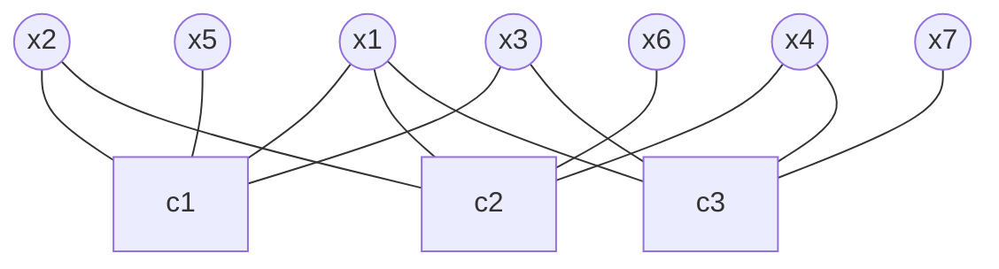

> [!info] This note is based on the online course [Lecture "Channel Coding: Graph-based Codes", Chapter 3, Vid. 9, "LDPC Decoding - Sum-product Algo."](https://www.youtube.com/watch?v=p7x-EOZF5zk&list=PLLDF9ieaJiSX-qDeYdrZNfpMo9UrUcu46&index=23)


The belief propagation (BP) algorithm (also known as sum-product algorithm) has been shown to be effective at decoding classical LDPC codes. It has a running time that is linear in the block length of the code. BP is a message passing algorithm, in which messages are passed along the edges of a Tanner graph.

---

- [0] 1. Gallagers' lemma

> [!lemma] Lemma (Gallager)
> Consider a sequence of $m$ independent random variables $\mathbf{A}=\left[A_1, A_2, \ldots, A_m\right]$, where $P\left(A_k=1\right)=p_k$. Then
> $$P(\mathbf{A} \text { has even parity })=\frac{1}{2}+\frac{1}{2} \prod_{k=1}^m\left(1-2 p_k\right)$$
> and
> $$P(\mathbf{A} \text { has odd parity })=\frac{1}{2}-\frac{1}{2} \prod_{k=1}^m\left(1-2 p_k\right)$$.


The [[Moment generating function]](MGF) of a random variable (Bernoulli variable) $A_k$  which is 1 with probability $p_k$ and 0 with probability $1-p_k$ is: 
$$M_{A_k}(t)=E\left(e^{t A_k}\right)=p_k e^t+\left(1-p_k\right).$$
Since the $A_k$ are independent, the MGF of $S = A_1 + \ldots + A_m$ is given by the product of the MGFs of the $A_k$: 
$$M_S(t)=\prod_{k=1}^m\left(p_k e^t+\left(1-p_k\right)\right).$$
The probability that $S$ is even can be calculated by evaluating the MGF of $S$ at $t = i\pi$ (since $e^{i \pi n}$ equals $(-1)^n$)[^1]: 
$$P(\mathbf{A} \text { has even parity })=E\left(\frac{1+(-1)^S}{2}\right)=\frac{1}{2}\left(1+E\left(e^{i \pi S}\right)\right)$$
Substitute $t = i \pi$ into the MGF of $S$:
$$M_S(i \pi)=\prod_{k=1}^m\left(p_k e^{i \pi}+\left(1-p_k\right)\right)=\prod_{k=1}^m\left(p_k(-1)+\left(1-p_k\right)\right)=\prod_{k=1}^m\left(1-2 p_k\right)$$
Thus, the expression for $P(S \text{ is even})$ is:
$$P(S\text{ is even})=\frac{1}{2}\left(1+M_S(i \pi)\right)=\frac{1}{2}\left(1+\prod_{k=1}^m\left(1-2 p_k\right)\right).$$
---

- [1] 2.  [[Log-Likelihood Ratios|LLRs]] and repetition codes (copy of [[Repetition codes#^79414d]])

We now consider the $\mathcal{C}_{\text {rep }}(n, 1)$ repetition code, where a bit $x \in\{0,1\}$ is transmitted and the vector $\boldsymbol{y}=\left(y_1, y_2, \ldots, y_n\right)$ is received. We assume that $P(X=0)=P(X=1)=\frac{1}{2}$.

We compute the a posteriori LLR (see [[Log-Likelihood Ratios#^158e94]])
$$L(X \mid \boldsymbol{y})=L(\boldsymbol{y} \mid X)=\ln \left(\frac{p(\boldsymbol{y} \mid X=0)}{p(\boldsymbol{y} \mid X=1)}\right)$$
which can be expressed by assuming the property that the channel is memoryless
$$L(X \mid \boldsymbol{y})=\ln \left(\frac{\prod_{i=1}^n p\left(y_i \mid X=0\right)}{\prod_{i=1}^n p\left(y_i \mid X=1\right)}\right)=\sum_{i=1}^n \ln \left(\frac{p\left(y_i \mid X=0\right)}{p\left(y_i \mid X=1\right)}\right).$$

Thus, we finally get for the $\mathcal{C}_{\text {rep }}(n, 1)$ repetition code assuming uniform priors that
$$L(X \mid \boldsymbol{y})=\sum_{i=1}^n L\left(y_i \mid X\right)$$
i.e., the a posteriori LLR is the sum of the channel-transition LLRs, which can be easily computed.  ^f825f8

The [[MAP decoding|MAP]] decoder for the repetition code thus takes the LLRs for each channel output and adds them. The MAP decision is $\hat{x}=0$ if $L(X \mid \boldsymbol{y}) \geq 0$ and $\hat{x}=1$ otherwise, i.e.,
$$\hat{\ddot{x}}=\operatorname{sign}(L(X \mid \boldsymbol{y}))=\operatorname{sign}\left(\sum_{i=1}^n L\left(y_i \mid X\right)\right)$$
---

 - [2] 3. [[Log-Likelihood Ratios|LLRs]] and repetition codes - LDPC context (copy of [[LDPC codes#^8cb15c]])

The variable nodes of degree $d_{\mathrm{v}}$ of an LDPC code can be considered as $\left(d_{\mathrm{v}}+1,1\right)$ repetition codes where 1 bit is tranmitted over the channel and the other bits are "transmitted over the graph" (<mark style="background: #D2B3FFA6;">from variable node to check nodes</mark>). As in "soldier counting" we send a message once we have received $d_{\mathrm{v}}-1$ messages variable Nodes, Example $d_{\mathrm{v}}=4$ :

```mehrmaid
graph TB
    A["$L(y_i \mid X_i)$"] --> B(( ))
    C["$L(\chi_1)$"] --> B
    D["$L(\chi_2)$"] --> B
    E["$L(\chi_3)$"] --> B
    B --> F["$L(\xi_4)$"]
    style B fill:#ccc,stroke:#333,stroke-width:2px
    style F stroke:#00f,stroke-width:2px,color:#00f

```
$$L\left(\xi_4\right)=L\left(y_i \mid X_i\right)+L\left(\chi_1\right)+L\left(\chi_2\right)+L\left(\chi_3\right)$$
Similarly, we get for the other edges
$$
\begin{aligned}
& L\left(\xi_1\right)=L\left(y_i \mid X_i\right)+L\left(\chi_2\right)+L\left(\chi_3\right)+L\left(\chi_4\right) \\
& L\left(\xi_2\right)=L\left(y_i \mid X_i\right)+L\left(\chi_1\right)+L\left(\chi_3\right)+L\left(\chi_4\right) \\
& L\left(\xi_3\right)=L\left(y_i \mid X_i\right)+L\left(\chi_1\right)+L\left(\chi_2\right)+L\left(\chi_4\right)
\end{aligned}
$$
i.e., we exclude the edge under consideration from the computation (extrinsic message).

The best decision for the bit $\hat{x}_i$ is obtained from the a posteriori LLR (see above [[Belief propagation#^f825f8]])
$$L\left(X_i \mid \boldsymbol{y}\right)=L\left(y_i \mid X_i\right)+\sum_{i=1}^4 L\left(\chi_i\right)$$

---

- [3] 4. [[Log-Likelihood Ratios|LLRs]] and [[Single parity check codes]] (SPC codes)

We now consider the $\mathcal{C}_{\text {SPC }}(n, n-1)$ single-parity-check code and transmission of length-$n$ codewords $x$ over a memoryless channel whose output is $y$.

Remember that the bits $x_i$ in each codeword $\boldsymbol{x}^{[m]}$ have a single constraint: There must be an even number of "1"s on $x^{[m]}$.

Without loss of generality, we formulate the [[MAP decoding]] rule for bit $x_1$
$$\hat{x}_1=\arg \max _{b \in\{0,1\}} P\left(x_1=b \mid \boldsymbol{y} \text {, even number of " } 1 \text { "s in } \boldsymbol{x}\right)$$
and we have
$$
\begin{aligned}
P\left(x_1=0 \mid \boldsymbol{y}, \text { even no. of " } 1 \text { "s in } \boldsymbol{x}\right) & =P\left(x_2, \ldots, x_n \text { has even no. " } 1 \text { "s } \mid \boldsymbol{y}\right) \\
& =\frac{1}{2}\left(1+\prod_{\ell=2}^n\left(1-2 P\left(x_{\ell}=1 \mid y_{\ell}\right)\right)\right)
\end{aligned}
$$

In order to simplify notation, we define
$$
\begin{aligned}
& P\left(x_1=0 \mid \boldsymbol{y}, \text { even no. of " } 1 \text { "s in } \boldsymbol{x}\right):=P\left(x_1=0 \mid \boldsymbol{y}, \mathrm{SPC}\right) \\
& P\left(x_1=1 \mid \boldsymbol{y}, \text { even no. of " } 1 \text { "s in } \boldsymbol{x}\right):=P\left(x_1=1 \mid \boldsymbol{y}, \mathrm{SPC}\right)
\end{aligned}
$$

Rearranging the equation
$$
\begin{aligned}
P\left(x_1=0 \mid \boldsymbol{y}, \mathrm{SPC}\right) & =\frac{1}{2}\left(1+\prod_{\ell=2}^n\left(1-2 P\left(x_{\ell}=1 \mid y_{\ell}\right)\right)\right) \\
& =1-P\left(x_1=1 \mid \boldsymbol{y}, \mathrm{SPC}\right)
\end{aligned}
$$
which can be rearranged to
$$
1-2 P\left(x_1=1 \mid \boldsymbol{y}, \mathrm{SPC}\right)=\prod_{\ell=2}^n\left(1-2 P\left(x_{\ell}=1 \mid y_{\ell}\right)\right)
$$

Applying Equation [[Log-Likelihood Ratios#^c8571d]], we get

$$
1-2 P\left(x_1=1 \mid \boldsymbol{y}, \mathrm{SPC}\right) = \tanh \left(\frac{L\left(X_1 \mid \boldsymbol{Y}, \mathrm{SPC}\right)}{2}\right)=\prod_{\ell=2}^n \tanh \left(\frac{L\left(X_{\ell} \mid Y_{\ell}\right)}{2}\right)
$$
or, equivalently

$$
L\left(X_1 \mid \boldsymbol{Y}, \mathrm{SPC}\right)=2 \tanh ^{-1}\left(\prod_{\ell=2}^n \tanh \left(\frac{L\left(X_{\ell} \mid Y_{\ell}\right)}{2}\right)\right)
$$

Thus, the MAP decoder for bit $x_1$ in a length-$n$ SPC makes the decision $\hat{x}_1=0$ if $L\left(X_1 \mid \boldsymbol{Y}, \mathrm{SPC}\right) \geq 0$ and $\hat{x}_1=1$ otherwise, or, equivalently
$$
\hat{\ddot{x}}_1=\operatorname{sign}\left(2 \tanh ^{-1}\left(\prod_{\ell=2}^n \tanh \left(\frac{L\left(X_{\ell} \mid Y_{\ell}\right)}{2}\right)\right)\right)
$$

---

- [4] 5. [[Log-Likelihood Ratios|LLRs]] and SPC codes - [[LDPC codes|LDPC]] Context

The check nodes of degree $d_c$ of an LDPC code can be considered as $\left(d_{\mathrm{c}}, 1\right)$ single parity-check codes where the bits are "transmitted over the graph".

For example, when $d_c = 5$:

```mehrmaid
graph TB
    A["$L(\xi_1)$"] --> B(("$c_1$" ))
    C["$L(\xi_2)$"] --> B
    D["$L(\xi_3)$"] --> B
    E["$L(\xi_4)$"] --> B
    B --> F["$L(\chi_5)$"]
    style B fill:#ccc,stroke:#333,stroke-width:2px
    style F stroke:#00f,stroke-width:2px,color:#00f

```
With some abuse of notation, we denote the messages from variable nodes by $L\left(\xi_i\right)$ The message associated with edge 5 is
$$
L\left(\chi_5\right)=2 \tanh ^{-1}\left(\prod_{i=1}^4 \tanh \left(\frac{L\left(\xi_i\right)}{2}\right)\right)
$$
where we exclude edge 5 from the computation.

---

- [5] 6. Sum-product Algorithm

We require some notations before stating the sum-product LDPC decoding algorithm:

> [!definition] (Variable and Check Node Connection Sets)
> For an LDPC code with parity check matrix $\boldsymbol{H}(\operatorname{dim} \boldsymbol{H}=m \times n)$ :
> Let $\mathcal{N}(i)$ denote the <mark style="background: #D2B3FFA6;">connection set of variable node</mark> $v_i$, which contains the check node numbers of the check nodes connected by an edge to variable node $v_i$. (<mark style="background: #D2B3FFA6;">This gives us a $[d_v+1,1]$ repetition code</mark>). Formally
> $$\mathcal{N}(i)=\left\{j: H_{j, i}=1\right\}.$$
> Let $\mathcal{M}(j)$ denote the <mark style="background: #D2B3FFA6;">connection set of check node</mark> $c_j$, which contains the variable node numbers of the variable nodes connected by an edge to check node $c_j$. (<mark style="background: #D2B3FFA6;">This gives us a $[d_c, d_c-1]$ single-parity-check code</mark>). Formally
> $$\mathcal{M}(j)=\left\{i: H_{j, i}=1\right\}.$$

**Example: connection sets of $[7,4]$ Hamming code:**



Variable node connection sets
$$
\begin{aligned}
& \mathcal{N}(1)=\{1,2,3\},  \mathcal{N}(2)=\{1,2\}, \mathcal{N}(3)=\{1,3\}, \mathcal{N}(4)=\{2,3\} \\
& \mathcal{N}(5)=\{1\}, \mathcal{N}(6)=\{2\}, \mathcal{N}(7)=\{3\}
\end{aligned}
$$
Check node connection sets
$$\mathcal{M}(1)=\{1,2,3,5\}, \mathcal{M}(2)=\{1,2,4,6\}, \mathcal{M}(3)=\{1,3,4,7\}$$

> [!definition] Definition (Variable-to-Check Messages)
> We denote by $L_{i \rightarrow j}^{[v]}$ the LLR information computed by variable node $v_i$ and going to (via the edge in the Tanner graph) check node $c_j$.


> [!definition] Definition (Check-to-Variable Messages)
> We denote by $L_{i \leftarrow j}^{[c]}$ the LLR information computed by check node $c_j$ and going to (via the edge in the Tanner graph) variable node $v_i$.

The superscript ${ }^{[v]}$ or ${ }^{[c]}$ denotes if the information has been computed by a variable node or check node. The direction of the arrow $(\rightarrow$ or $\leftarrow)$ denotes the direction of the message flow.

> [!definition] Definition (Channel-related Messages)
> We abbreviate the channel-transition LLR information $L\left(y_i \mid X_i\right)=: \tilde{L}_i$.


Now we are ready to show the sum-product decoding algorithm of LDPC code!

> [!pesudocode] (Sum-product decoding algorithm)
>1. (Init.) For all $i \in\{1, \ldots, n\}$, set $L_{i \rightarrow j}^{[v]}=\tilde{L}_i=L\left(y_i \mid X_i\right), \forall j \in \mathcal{N}(i).$
>2. (CN Update) For every check node $c_j$, with $j \in\{1, \ldots, m\}$, compute $|\mathcal{M}(j)|$ outgoing messages $$L_{i \leftarrow j}^{[c]}=2 \tanh ^{-1}\left(\prod_{i^{\prime} \in \mathcal{M}(j) \backslash\{i\}} \tanh \left(\frac{L_{i^{\prime} \rightarrow j}^{[v]}}{2}\right)\right), \quad \forall i \in \mathcal{M}(j).$$
>3. (VN update) For every variable node $v_i$, with $i \in\{1, \ldots, n\}$, compute $|\mathcal{N}(i)|$ outgoing messages $$L_{i \rightarrow j}^{[v]}=\tilde{L}_i+\sum_{j^{\prime} \in \mathcal{N}(i) \backslash\{j\}} L_{i \leftarrow j^{\prime}}^{[c]}, \quad \forall j \in \mathcal{N}(i).$$
>4. (Total LLR) For $i \in\{1, \ldots, n\}$, compute $$L_i^{[\text {total] }]}=\tilde{L}_i+\sum_{j \in \mathcal{N}(i)} L_{i \leftarrow j}^{[c]} \text { and set } \quad \hat{x}_i= \begin{cases}1 & \text { if } L_i^{[\text {total }]}<0 \\ 0 & \text { else. }\end{cases}.$$ If $\boldsymbol{H} \hat{\boldsymbol{x}}^T=\mathbf{0}$, with $\hat{\boldsymbol{x}}=\left(\hat{x}_1, \ldots, \hat{x}_n\right)$ or maximum number iterations reached then stop, otherwise goto step 2.


- [6] 7. Discussions on the sum-product algorithm

The sum-product algorithm minimizes the bit-wise a posteriori probability
$$\hat{x}_i=\arg \max _{x_i \in\{0,1\}} P\left(X_i=x_i \mid \boldsymbol{y}\right).$$Under the assumption that the code bits $x_i$ are independent and the messages that are sent are independent, which is equivalent to saying that<mark style="background: #D2B3FFA6;"> the graph has no cycles</mark>. The assumptions are not met in practice, yet the decoder is extremely good and powerful and simple to implement. More details are given in the extra material section.

**Error Floor phenomenon**: An error floor is said to occur, if above a certain channel quality (e.g., $E_{\mathrm{b}} / N_0$ or $\delta$ ), the bit error error rate does not decrease rapidly anymore, but decreases with a smaller slope only. In the previous example, for $E_{\mathrm{b}} / N_0>4.5 \mathrm{~dB}$, the BER decreases by 100 per decibel only. This effects may limit the use of LDPC codes where very low BERs are targeted. Error floor is mostly due to combinations of cycles (so-called trapping sets) that cannot be recovered by the decoder. Active research field to construct LDPC codes that have very low error floor.

**Waterfall phenomenon**: The "waterfall region" in the Bit Error Rate (BER) versus $E_b / N_0$ graph is a characteristic feature of certain advanced error-correcting codes, such as Low-Density Parity-Check (LDPC) codes and Turbo codes. This region is named for its steep, almost vertical drop in the BER as the signal-tonoise ratio $E_b / N_0$ increases. Initially, when the $E_b / N_0$ is low, the noise in the channel is high relative to the signal energy, leading to a high BER because the decoder cannot effectively distinguish between the correct data and errors. As the $E_b / N_0$ increases (meaning the signal quality improves relative to the noise), the decoder starts to gain enough information from the redundancy in the code to more effectively correct the errors. ^138c47


> [^1]: When $t = i\pi$, the probability that $S$ is even, $P( \text{even } S)$, can be formulated by considering: $\mathbb{E}\left[(-1)^S\right]=P($ even $S)-P($ odd $S)$. Since the total probability $P($ even $S)+P($ odd $S)=1$, you can solve for $P($ even $S)$ as follows: $P($ even $S)=$ $\frac{1+\mathbb{E}\left[(-1)^S\right]}{2}$. When you evaluate the MGF $M_S(t)$ at $t=i \pi$ : $M_S(i \pi)=\mathbb{E}\left[(-1)^S\right]$ This gives: $P($ even $S)=\frac{1+M_S(i \pi)}{2}$. This expression neatly splits the probabilities of $S$ being even or odd based on the summation of probabilities weighted by $(-1)^S$.